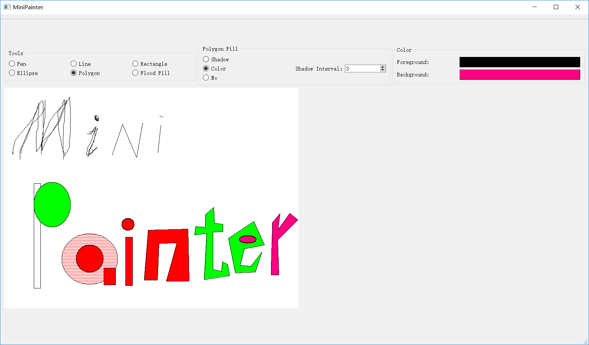

# MiniPaiter

计算机图形学课程设计

要求：设计和实现一个图形函数库，具有绘制直线段、任意圆弧、椭圆弧、多边形区域的阴影填充和颜色填充等功能（仅调用画点函数）

emmmmm索性做一个可以交互的东西出来好了

## 环境

基于QT开发

## 功能

用户可操作区域分为四个部分：
- 工具选择区
- 填充设置区
- 颜色选择区
- 绘图区

### 工具选择区

用户可以在此区域选择绘图工具。提供的绘图工具包括：
- 铅笔(Pen)
- 直线(Line)
- 矩形(Rectangle)
- 椭圆(Ellipse)
- 多边形(Polygon)
- 油漆桶(Flood Fill)

### 填充设置区

多边形、椭圆和矩形可以设置内部填充模式。填充模式分为三种：
- 阴影填充(Shadow)
- 纯色填充(Color)
- 不填充(No)

可以使用右边的spinbox设置阴影间隔。范围0-99，单位为像素，默认为1，如果取0则效果和纯色填充相同。

### 颜色选择区

包含两个按钮，分别是前景色选择按钮和背景色选择按钮。点击后会弹出颜色选择框。

### 绘图区

用户使用鼠标绘图的地方。不同的工具会有不同的交互方式。

- 铅笔(Pen)
  - 鼠标拖动以画图。可以画到画布外面
- 直线(Line)
  - 鼠标拖动以画线。可以画到画布外面
- 矩形(Rectangle)
  - 鼠标拖动以选择矩形轮廓。可以画到画布外面。松开鼠标后才会有填充效果
- 椭圆(Ellipse)
  - 鼠标拖动以选择**矩形**轮廓。可以画到画布外面。松开鼠标后才会显示椭圆及其填充效果
- 多边形(Polygon)
  - 鼠标左键点击以依次选择多边形顶点，右键点击以封闭图形。**无法画到画布外面，必须使用鼠标右键使其闭合**（因为懒得写错误处理了。。。先挖个坑
- 油漆桶(Flood Fill)
  - 鼠标左键点击一个像素后会把这个像素以及此像素的4连通区域的同色像素变为前景色